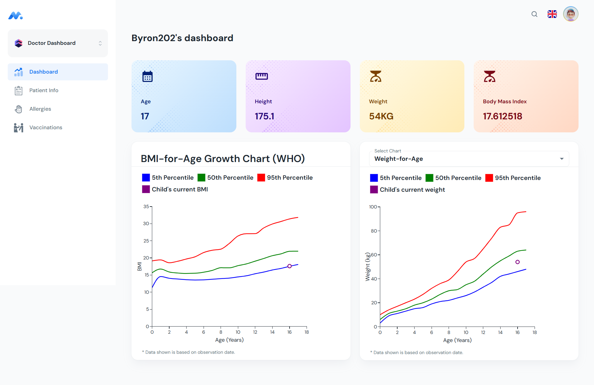
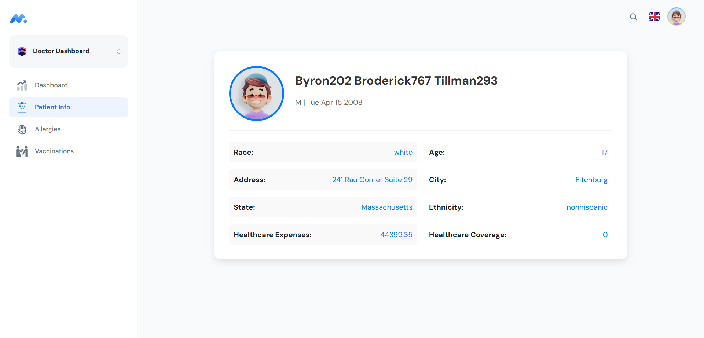
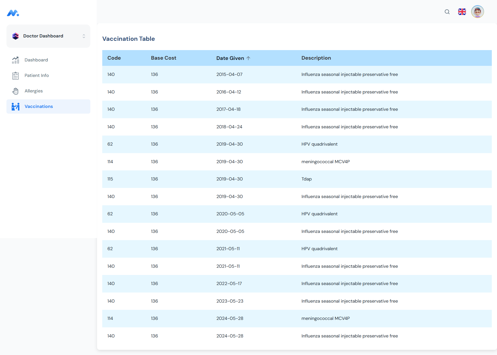

# 👶 Pediatric App

A pediatric patient management web application developed as part of a **group project** for the **OMSCS (Online Master of Science in Computer Science)** program.

🚀 **[Live Demo on Netlify](https://pediatricapp-team16.netlify.app/)**

---

## 📸 Screenshots






---

## 🛠 Technologies Used

- **React** (with TypeScript)
- **Material UI (MUI)** for UI components
- **React Router** for routing
- **Vite/Webpack** for development and bundling

---

## 📁 Project Structure

src/
├── components/ # Reusable UI components
├── layouts/ # Page layouts
├── pages/ # Main application pages
├── routes/ # Routing configuration
├── hooks/ # Custom React hooks
├── utils/ # Helper functions
├── main.tsx # Entry point
└── app.tsx # Main app logic

yaml
Copy
Edit

---

## 📌 Available Pages

| Path         | Description             |
|--------------|-------------------------|
| `/`          | User Management Page    |
| `/dashboard` | Dashboard Page          |
| `/info`      | Patient Info Page       |

---

## 🚀 Getting Started

### Prerequisites

- Node.js (LTS version)
- npm (comes with Node.js)

### Installation

```bash
# Clone the repository
git clone https://github.gatech.edu/smohamed42/pediatricApp-Team16.git

# Navigate to the project
cd pediatricApp-Team16

# Install dependencies
npm install
Running the App
bash
Copy
Edit
npm run dev
📝 Notes
This application was developed collaboratively by Team 16 as part of the OMSCS curriculum.

📬 Contact
Feel free to reach out or open an issue if you encounter any problems or have suggestions!

🎉 Thank you for visiting!
